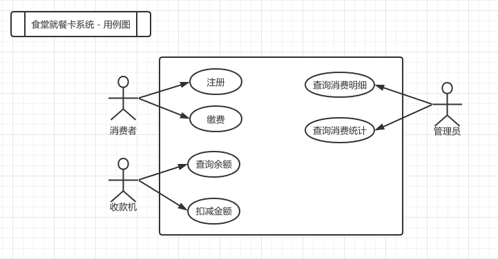
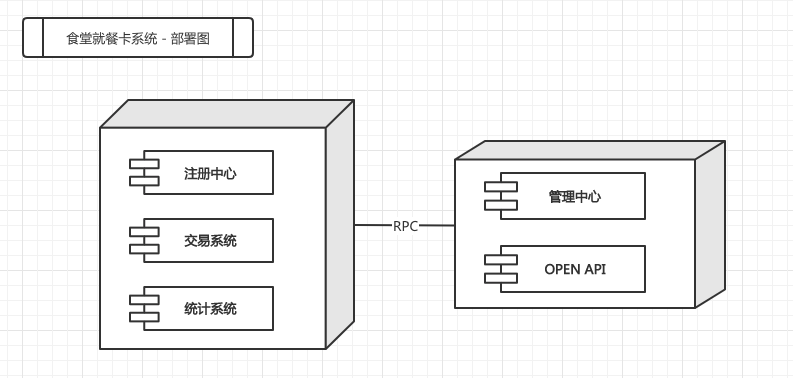
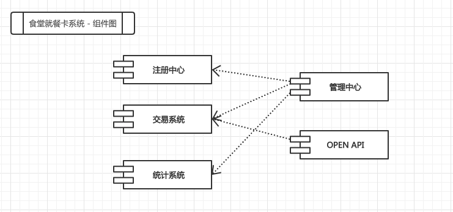
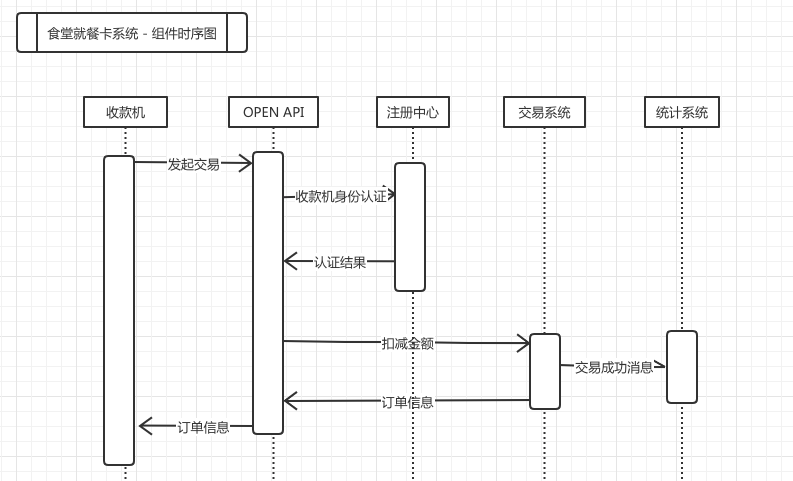

## 食堂就餐卡系统设计文档

### 1. 设计概述

	[TBD]

#### 1.1 功能概述

* 系统中每个【消费者】都有一张卡，在【管理中心】注册缴费，卡内记着消费者的身份、余额。
* 使用时将卡插入【收款机】则显示卡上金额，【服务员】按收款机上数字键，收款机自动计算并显示消费额及余额。
* 管理中心的【管理员】监视每一笔消费，可打印出消费情况的相关统计数据。

#### 1.2 用例分析

#### 1.2 非功能约束

	[TBD]

### 2. 系统部署图和整体设计

系统上线时预计部署4台物理机，5个子系统。

项目运行初期可将注册中心，交易系统和统计系统部署于同一个结点，用于提供基础服务，管理中心和OPEN API 部署于同一个结点，用于为终端用户提供系统界面或API. 

#### 2.1 系统部署图

注册中心用于就餐卡及收款机注册，交易系统用于余额查询，交易处理，统计系统用于统计指标计算及查询，项目运行初期注册中心，
管理中心为消费者及管理员提供web界面，OPEN API为收款机提供余额查询及交易处理接口。

#### 2.2 组件图

### 2.3 交易场景序列图

