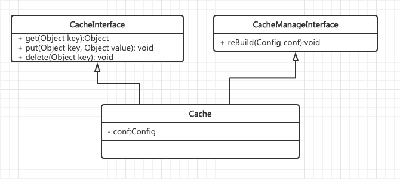

## 作业一

请描述什么是依赖倒置原则？

```
高层模块不依赖于低层，而是大家都依赖于抽象
抽象不能依赖实现，而是实现依赖抽象

DIP倒置的是模块间的依赖关系以及开发的顺序和职责
```

为什么有时候依赖倒置原则又被称为好莱坞原则？

```
好莱坞原则: Don't call me ,I will call you. 

高层代码不需要调用低层代码（框架代码），只需要实现低层代码定义好的接口，在运行时就会自动被调用。 
这样做的结果是高层不会依赖于低层逻辑，而是依赖于低层定义的抽象接口，结果是遵循依赖倒置原则的
```


## 作业二

请描述一个你熟悉的框架，是如何实现依赖倒置原则的？

```
Laravel(PHP)： 使用Ioc容器实现依赖倒置，主体不需要创建对象，而是使用注入的方式从容器中获得对象，因此也主体不会直接依赖对象，而是依赖于对象的抽象（接口定义）
```

## 作业三

请用接口隔离原则优化 Cache 类的设计，画出优化后的类图

cache 实现类中有四个方法，其中 put get delete 方法是需要暴露给应用程序的，rebuild 方法是需要暴露给系统进行远程调用的。如果将 rebuild 暴露给应用程序，应用程序可能会错误调用 rebuild 方法，导致 cache 服务失效。按照接口隔离原则：不应该强迫客户程序依赖它们不需要的方法。也就是说，应该使 cache 类实现两个接口，一个接口包含 get put delete 暴露给应用程序，一个接口包含 rebuild 暴露给系统远程调用。从而实现接口隔离，使应用程序看不到 rebuild 方法。




