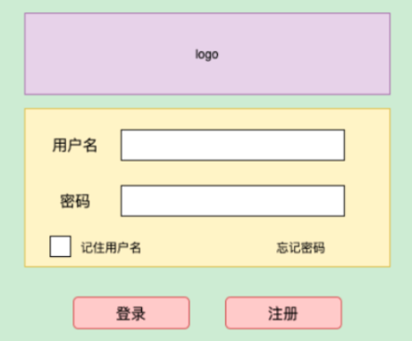

## 作业一
请在草稿纸上手写一个单例模式的实现代码，拍照提交作业


## 作业二
请用组合设计模式编写程序，打印输出图1的窗口，窗口组件的树结构如图2所示，打印输出示例参考图3

### 图1



### 图2


### 图3

```
print WinForm(WINDOW窗口)
print Picture(LOGO图片)
print Button(登录)
print Button(注册)
print Frame(FRAME1)
print Label(用户名)
print TextBox(文本框)
print Label(密码)
print PasswordBox(密码框)
print CheckBox(复选框)
print TextBox(记住用户名)
print LinkLabel(忘记密码)

```

### 类图设计


### 代码

基类定义
```java
public class Element {
    private String name;
    private String text;
    public Element(String name, String text) {
        this.name = name;
        this.text = text;
    }
    public void print(){
        System.out.println(String.format("print %s(%s)", name, text));
    }
}


public class Container extends Element {
    private List<Element> elements = new ArrayList<>(10);

    public Container(String name, String text) {
        super(name, text);
    }

    public void addElement(Element element) {
        elements.add(element);
    }

    @Override
    public void print() {
        super.print();
        elements.forEach(e -> {
            e.print();
        });
    }
}
```

具体元素类定义

```java
class WindowForm extends Container{
	public WindowForm(String text) {
		super("WinForm", text);
	}
}
class Button extends Element {
	public Button(String text) {
		super("Button", text);
	}
}
class Picture extends Element{
	public Picture(String text) {
		super("Picture", text);
	}
}
class Frame extends Container{
	public Frame(String text){
		super("Frame", text);
	}
}
class Label extends Element{
	public Label(String text){
		super("Label", text);
	}
}
class TextBox extends Element{
	public TextBox(String text){
		super("TextBox", text);
	}
}
class PasswordBox extends Element{
	public PasswordBox(String text){
		super("PasswordBox", text);
	}
}
class CheckBox extends Element{
	public CheckBox(String text){
		super("CheckBox", text);
	}
}
class LinkLabel extends Element{
	public LinkLabel(String text){
		super("LinkLabel", text);
	}
}
```

打印实现

```java
class Demo{
	public static void main(){
		WindowForm form = new WindowForm('WINDOW窗口');

		form.addElement(new Picture("LOGO图片"));
		form.addElement(new Button("登录"));
		form.addElement(new Button("注册"));

		Frame frame = new Frame("FRAME1");
		form.addElement(frame);

		frame.addElement(new Label("用户名"));
		frame.addElement(new TextBox("文本框"));
		frame.addElement(new Label("密码"));
		frame.addElement(new PasswordBox("密码框"));
		frame.addElement(new CheckBox("复选框"));
		frame.addElement(new TextBox("记住用户名"));
		frame.addElement(new LinkLabel("忘记密码"));

		form.print();
	}
}
```
