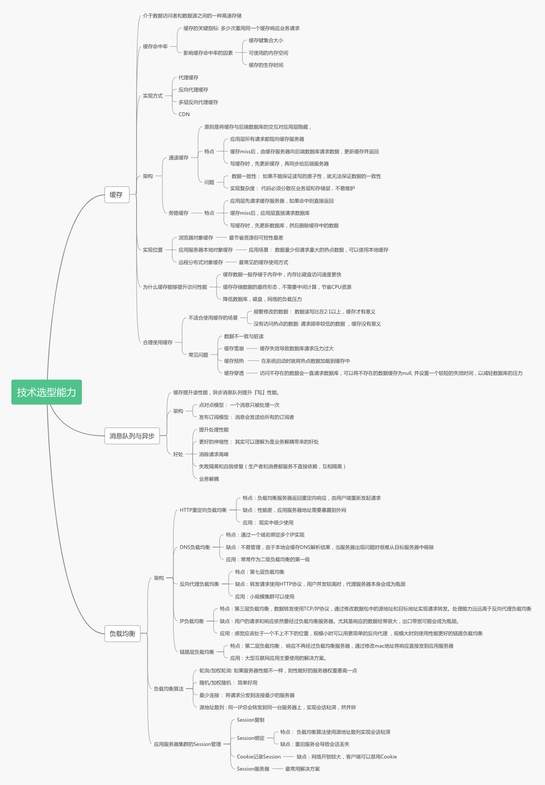

# 技术选型能力反映了架构师的综合水平

本周主要学习的是缓存,消息队列和负载均衡的技术要点以及技术选型，从课程的标题就可以看出，选型的过程是比技术本身更加重要的，架构师重要的一个能力就是做决策，衡量多个架构方案的优缺点，结合实际情况判断缺点是否能够接受，优点和付出是否成正比。

## 缓存 

缓存的特点是『简单』，关键点是『简单的技术要简单的用』，和永久存储数据不同，缓存数据是不怕丢失的，只要控制好缓存的命中率，进而控制对数据库的影响，在这个前提下，一定程度的数据丢失都是可以接受的。

## 知识要点

## 技术选型小技巧

1. 将技术关键字在搜索引擎中进行查询 ，通过搜索的结果数量判断该技术的『热度』
2. 考虑团队内部人员对技术的熟悉程度
