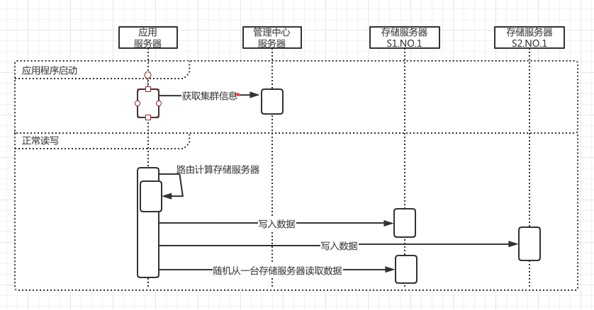
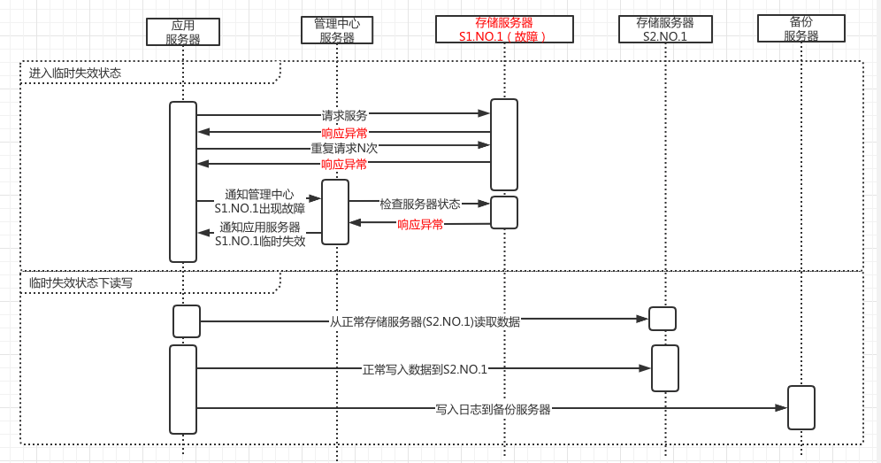
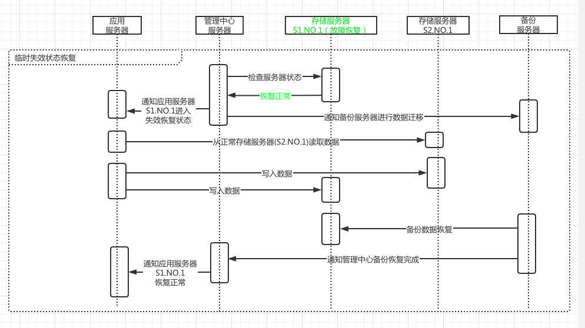

## 作业一： 请简述 CAP 原理

### CAP定义

- 一致性 Consistency  
每次读取的数据应该是最新的数据或返回一个错误，不能是过期的数据 

- 可用性 Availablity  
每次请求都应该得到一个响应，而不应该返回错误或失去响应，但并不保证数据是最新的

- 分区耐受性 Partition Tolarance  
因为网络原因部分服务器节点不可用了，系统依然应该是可以操作的

CAP原理说的是一个分布式系统在满足分区耐受性的前提下，一致性和可用性是无法同时满足的, 因此架构师在设计系统时，不要浪费精力设计同时满足三者的完善架构，要在A(可用性)和C(一致性)之间做出取舍。在架构领域，很多情况下鱼和熊掌是不可兼得的。

需要注意的是，A和C无法同时满足，但是：

- 满足了一方，并不代表着就一定要完全抛弃另一方，只是在一定程度上做出牺牲。
- 牺牲了C，并不代表A就得到了保证， AC之间并不是『非此即彼』的关系，有时候甚至是『荣辱与共』的。

### BASE理论： CAP中对可用性和一致性权衡的结果 

- 基本可用 Basically Available  
分布式系统出现故障时，保证核心功能可用，允许损失部分可用性

- 弱状态 Soft State  
允许系统中的数据存在中间状态，并认为该中间状态不会影响系统的整体可用性，即允许系统不同节点的数据副本之间进行同步的过程存在延时

- 最终一致性 Eventually consistent  
最终一致性强调的是系统中所有的数据副本，在经过一段时间的同步后，最终能达到一致的状态。
ACID 要求强一致性，通常运用在传统的数据库系统上。而 BASE 要求最终一致性，通过牺牲强一致性来达到可用性。

## 作业二：针对 Doris 案例，请用 UML 时序图描述 Doris 临时失效的处理过程（包括判断系统进入临时失效状态，临时失效中的读写过程，失效恢复过程）。

正常状态下的处理流程:

临时失效状态下的处理流程:

临时失效恢复处理流程:

