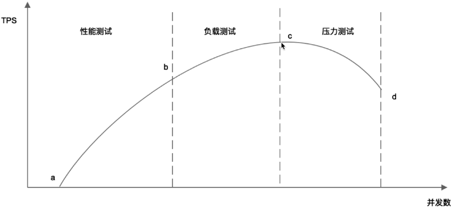
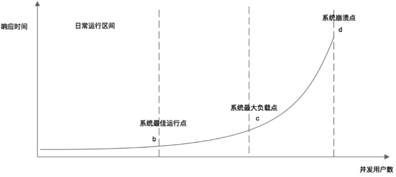

# 周总结

## 性能测试

使用了特定的技术方案不是最终目的，性能的提升才是，而观察性能的提升有两个视角：

主观视角：用户感受到的性能和真实的性能可能是不一样的 (可以通过产品设计等有效改善用户体验，不一定非要是技术手段）
客观视角：性能指标

性能测试是性能优化的前提和基础


### 核心性能指标

- 响应时间： 请求发出到『最后』接收到数据的时间

- 并发数：系统同时处理请求的数量，与此对应的还有『在线用户数』和『系统用户数』

- 吞吐量：单位时间内系统处理的请求数量

```
TPS:每秒处理事务数量，也可以用来泛指请求数量
HPS:每秒HTTP请求数量
QPS:每秒请求数量
```

### 其它性能指标

- 性能计数器： 描述服务器或操作系统的一些数据指标，这些指标是系统监控的重要参数 ，可以对这些指标设置报警阈值

```
  System Load: 正在处理的线程数和等待处理的线程数之和，Load等于CPU的核数时比较合理
  线程数，进程数，CPU,内存，网络，磁盘等
```
  
### 性能测试方法

性能测试： 以系统初期规划的性能指标为预期，对系统不断施加压力，目的验证系统性能能否达到预期。

负载测试： 在系统性能达到预期后，继续施加压力，测试TPS最大时的并发数。

压力测试： 在系统达到最大吞吐量后，继续施加压力，此时系统处理能力会逐渐下降，直到系统崩溃。


性能测试最终就是要得到如下的性能曲线 ：






## 性能优化

### 基本原则 

- 你不能优化一个没有『性能测试』的软件： 系统有没有性能问题以及优化的结果好不好不是架构师说了算，而是指标说了算。
- 你不能优化一个你不了解的软件


### 性能优化的一般方法

- 性能测试，获得性能指标 - 性能测试是性能优化的前提和基础
- 指标分析： 发现性能与资源瓶颈点
- 架构与代码分析：寻找性能与资源瓶颈关键
- 架构与代码优化：优化关键技术点，平衡资源复用
- 性能测试：进入性能优化闭环。


了解问题比掌握技术，使用技术更关键。不要盲目的使用技术。


### 系统性能优化的分层思想

- 机房与骨干网络性能优化

```
异地多活的多机房架构
专线网络与自主CDN建设
```

- 服务器与硬件性能优化： 垂直伸缩，用钱解决问题

- 操作系统性能优化

- 虚拟机性能优化

- 基础组件性能优化

- 软件架构性能优化

三板斧

```
缓存：优化读取操作
异步：优化写操作
分布式集群：集群的技术目标只有一个，如何使很多台服务器对使用者而言看起来像一台服务器
```


- 软件代码性能优化

最重要的是遵循面向对象的设计原则与设计模式编程，写清晰的，好的代码


## 操作系统

程序： 静态代码

进程： 程序运行起来后，被称作进程

```
进程包括如下组成部分：
可执行代码
堆内存空间
栈内存空间
进程数据结构
```


### 进程的运行期状态

- 运行: 进程正在CPU上运行
- 就绪: 进程获得了除CPU以外的所有资源，只差被CPU执行
- 等待: 进程正在等待某一资源，此时无法被CPU执行


### 进程 vs 线程

因为CPU切换执行进程代价非常大，因此有了线程

线程可以理解为轻量级的进程，『可执行代码』在进程空间中，所有线程共享，堆内存空间也是所有线程共享，而

栈内存空间则是每个线程单独分配，保证线程间互不影响

对象实例化后放在堆空间中（所有线程共享，当对象实例化使用单例模式时，所有线程访问的将是同一个实例），实例地址放在栈空间中（线程独有）


```
问题：
进程调度和线程调度有什么区别？线程是CPU调试的最小单位？
进程的栈内存空间有什么用？
```


### 线程安全 , 临界区

线程安全： 多个线程同时对一个堆空间中的数据进行修改

临界区： 多个线程访问进程共享资源的这段代码（即可能会出现线程安全的代码），被称为临界区，临界区加锁可以解决线程安全问题


### 锁

锁的实现需要操作系统级的支持

CAS(V, E, N) - compare and set 系统原语： 原语的执行必须是连续的，执行过程中不允许被中断

- V: 要更新的变量
- E: 预期值
- N: 新值

各种类型的锁 ???


