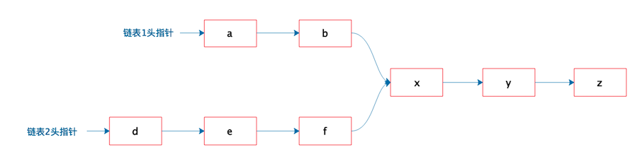

# 作业一

有两个单向链表（链表长度分别为 m，n），这两个单向链表有可能在某个元素合并，如下图所示的这样，也可能不合并。现在给定两个链表的头指针，在不修改链表的情况下，如何快速地判断这两个链表是否合并？如果合并，找到合并的元素，也就是图中的 x 元素。
请用（伪）代码描述算法，并给出时间复杂度和空间复杂度。



## 链表数据结构定义

```java
public class LinkedNode {
    public int value;
    public LinkedNode next;
}
```

## 查找合并的元素

```java
public class LinkedNodeTest {
    @Test
    public void testFindMergeNode() {
        LinkedNode head1 = initLinkedNode(new int[]{1, 2, 3, 4});
        LinkedNode head2 = initLinkedNode(new int[]{0, 2, 3, 4});
        Optional<Integer> mergedNode = findMergedNode(head1, head2);
        Assert.assertEquals(Optional.of(2), mergedNode);
    }

    @Test
    public void testNoMergedNode() {
        LinkedNode head1 = initLinkedNode(new int[]{1, 2, 3, 4});
        LinkedNode head2 = initLinkedNode(new int[]{5, 6, 7, 8});
        Optional<Integer> mergedNode = findMergedNode(head1, head2);
        Assert.assertEquals(Optional.empty(), mergedNode);
    }

    private Optional<Integer> findMergedNode(LinkedNode head1, LinkedNode head2) {
        Set<Integer> nodeValues = new HashSet<>();
        while (head1 != null) {
            nodeValues.add(head1.value);
            head1 = head1.next;
        }
        while (head2 != null) {
            if (nodeValues.contains(head2.value)) {
                return Optional.of(head2.value);
            }
            head2 = head2.next;
        }
        return Optional.empty();
    }

    private LinkedNode initLinkedNode(int[] values) {
        LinkedNode prev = null;
        LinkedNode current = null;
        for (int i = values.length - 1; i >= 0; i--) {
            current = new LinkedNode();
            current.value = values[i];
            current.next = prev;
            prev = current;
        }
        return current;
    }

```

